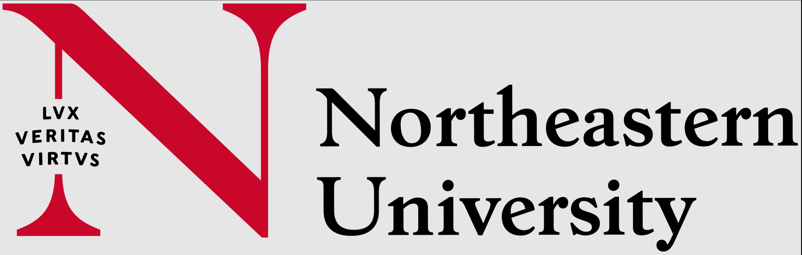

# CS 2510: Fundamentals of Computer Science 2

<div align="center">
  
  <br><br>
  <h2>Fundamentals of Computer Science 2</h2>
  <p><strong>5 Credit Hours | Khoury College of Science</strong></p>
</div>

## 📚 Course Overview

**CS 2510** Continues CS 2510. Examines object-oriented programming and associated algorithms using more complex data structures as the focus. Discusses nested structures and nonlinear structures including hash tables, trees, and graphs. Emphasizes abstraction, encapsulation, inheritance, polymorphism, recursion, and object-oriented design patterns. Applies these ideas to sample applications that illustrate the breadth of computer science.

## 📋 Course Details

| Category                 | Information |
| :----------------------- | :---------- |
| **Semester**             | Summer 1 2025 |
| **Grade Earned**         | 102.07% (A) |
| **Programming Language** | Java        |

## 🏛️ Repository Structure

```
.
├── README.md          # Course information (this file)
├── Course File/       # Official Lecture Notes
├── Labs/              # Lab Assignments
├── Homework/          # Homework Files
```

---

<div align="center">
  <p><em>© Vignesh Saravanakumar 2025 | Northeastern University</em></p>
</div>
